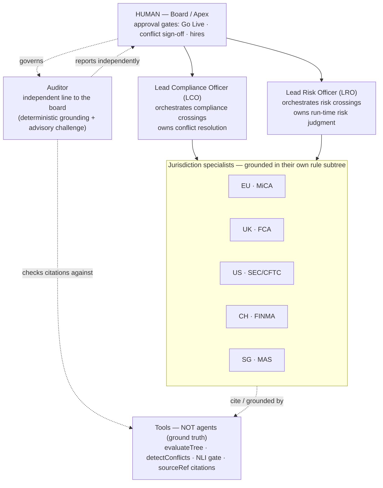
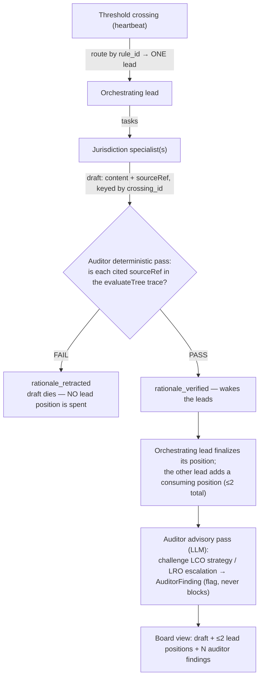
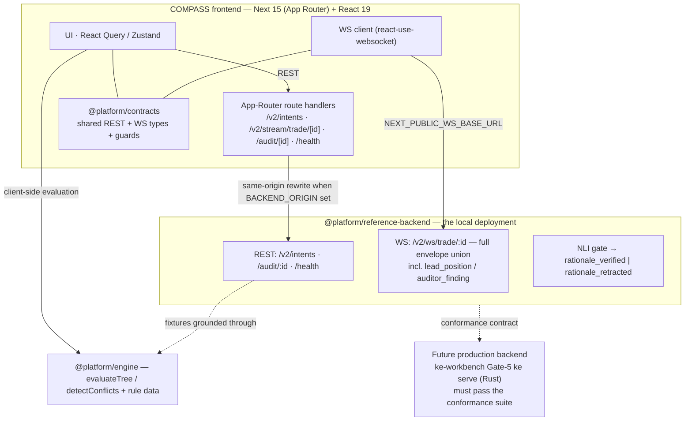

# COMPASS

> **C**ompliance **O**rchestration for **M**ulti-jurisdiction **P**athways **A**nd **S**treaming **S**urveillance.

**Real-time, auditable compliance for cross-border digital-asset trading.** COMPASS watches a live trade, detects the moment it crosses a regulatory threshold in any of five jurisdictions (EU·MiCA, UK·FCA, US·SEC/CFTC, CH·FINMA, SG·MAS), and produces a **cited, human-reviewable verdict** — with every claim grounded in a deterministic rule engine and gated by an entailment (NLI) verifier before it is shown. A small **org of specialist agents** does the judgment work; the deterministic engine is ground truth; **a human holds the apex.**

**[Live Demo](https://cross-border-compliance-navigator-sepia.vercel.app/)** · [Streaming contract](packages/contracts/README.md) · run it locally in one command: `npm run dev:all` ([Quick start](#quick-start))


[](https://cross-border-compliance-navigator-sepia.vercel.app/)

---

## Why COMPASS

Cross-border crypto regulation is **contradictory, fast-moving, and high-stakes**: the same trade can be compliant in one jurisdiction and blocked in another, the line that matters is crossed *mid-session*, and a wrong call is a reportable control failure. Most tooling answers "is this allowed?" with a static lookup. COMPASS answers it **continuously, with provenance**:

- **Catches the crossing, not just the snapshot.** The atomic unit is a *threshold crossing* — one citation, one snapshot, one verdict transition (`compliant → conditional → blocked`) — detected live on a sequenced trade feed.
- **Every rationale is grounded before it's shown.** An LLM drafts the explanation; an independent **NLI gate** checks each citation against the engine's actual evaluation trace. Ungrounded drafts are *retracted at the gate*, never surfaced.
- **Accountability is built in.** Judgment is delegated to specialist agents under an explicit org with audit independence; the human board signs off (Go Live, conflict resolution). Nothing executes on an unverified claim.
- **Replayable audit trail.** The whole session — ticks, crossings, rationales, lead positions, auditor findings — reconstructs deterministically from an append-only envelope log.

**Who it's for:** compliance and risk desks at institutions trading digital assets across borders, and the engineers who build their controls.

---

## What COMPASS is

COMPASS is the frontend for an institutional cross-border digital-asset compliance system, built as a **Next 15 (App Router) + React 19** app over an npm-workspaces monorepo. It combines two complementary capability stacks:

1. **Multi-jurisdiction analysis (REST).** A "Decision Canvas" evaluates a trade or instrument against five frameworks at once, using a client-side, Clojure-inspired rule evaluator over versioned decision trees, plus a conflict detector that reconciles divergent jurisdiction outcomes.
2. **Live streaming surveillance (WebSocket / SSE).** A "Live Trading Session" subscribes to a sequenced feed of trade ticks, detects **threshold crossings**, and streams an LLM-generated **rationale gated by an NLI verifier** — each rationale transitions `streaming → verified | retracted` against an entailment score.

The non-deterministic judgment in stack 2 — interpreting a crossing, resolving jurisdiction conflicts, drafting rationale, assessing run-time risk — is performed by an **org of specialist agents** ([Roles & agents](#roles--agents)). The deterministic engine verifies; the human is the apex.

> **Advanced state (this tree).** The app has completed its **Vite → Next 15 App Router** migration (self-hosted route handlers for `/v2/intents`, `/v2/stream/trade/[id]`, `/audit/[id]`, `/health`), ships the **Desk MVP** ([Desks](#desks)), and surfaces **ATLAS artifact provenance** as a consumer ([ATLAS provenance](#atlas-provenance-consumer)). Gates are green: `typecheck` · `lint` · `188` tests · `next build`.

---

## Features

- **Multi-jurisdiction analysis** — evaluate EU/UK/US/CH/SG frameworks simultaneously (`POST /navigate`).
- **Decision-tree visualization** — interactive SVG (Reingold–Tilford layout) with pan/zoom and evaluation-path highlighting.
- **Client-side rule engine** — pure functional evaluator with full trace generation, fact-hash memoization, and partial (missing-fact) branch exploration.
- **Conflict detection** — classification / timeline / obligation conflicts across jurisdictions with resolution strategies (`satisfy_both`, `stricter`, `earliest`, `cumulative`, `home_jurisdiction`).
- **Trace Explorer** — step-by-step evaluation audit trail with per-step actual-vs-expected values and citation links.
- **Decision Decoder** — tiered AI explanations (retail / protocol / institutional / regulator) of rule outcomes.
- **What-If analysis** — counterfactual scenarios (jurisdiction / entity / threshold / temporal) with a result + risk-delta diff.
- **Live Trading Session** — `/live/:intentId`: live ticks → threshold crossings → Claude-streamed rationale gated by an NLI verifier, with monotonic-sequence gap recovery via audit replay.
- **Agent org** — a crossing routes to exactly one orchestrating lead, which collects specialist drafts; an independent auditor grounds them; the board view shows draft + ≤2 lead positions + N auditor findings. **Implemented and tested.**
- **Desks** — a demo institutional identity (a *Desk*) scopes who is going live, with desk↔session association in the app layer.

---

## Roles & agents

The live session's judgment work is organized as an **org with delegation and governance**, modeled on the Paperclip org/governance pattern. Specialist agents across one management layer do the irreducibly non-deterministic work; the deterministic primitives (`evaluateTree`, `detectConflicts`, the NLI gate, `sourceRef` citations) stay **tools, not agents**.

> **The agents do judgment. The engine verifies. The human is the apex.** There is no coordinator/CEO agent — the human holds the apex via board approval gates (Go Live, conflict sign-off).



| Agent | Count | Role |
|---|---|---|
| **Jurisdiction specialist** | 5 | EU/MiCA, UK/FCA, US/SEC-CFTC, CH/FINMA, SG/MAS. Scoped to its own rule subtree; may only cite `sourceRef`s from that subtree (the pre-grounding that gives the NLI gate concrete ground truth per agent). Produces the shared rationale draft when tasked. |
| **Lead Compliance Officer (LCO)** | 1 | Orchestrates specialists for compliance-type crossings; owns conflict resolution (`detectConflicts` / `mergeObligations`) and obligation synthesis. |
| **Lead Risk Officer (LRO)** | 1 | Orchestrates specialists for risk-type crossings; owns run-time risk judgment (VaR, slippage, escalation) over the live snapshot. |
| **Auditor** | 1 | Reports directly to the board, not the leads (audit independence). Two-tiered: a deterministic grounding pass (free) and an advisory LLM challenge pass (judgment). |

### The orchestration invariant

**One crossing → one orchestrator → one draft → two lead positions → N auditor findings.**

The orchestrator is selected per crossing by the originating `rule_id` — a pure, total lookup in [`orchestratorRouting.ts`](src/features/live-session/orchestratorRouting.ts):

```typescript
import { orchestratorFor } from '@features/live-session/orchestratorRouting';

orchestratorFor('MICA_ART_5_1');   // 'compliance'  — obligation / whitepaper / authorization
orchestratorFor('RISK_VAR_95');    // 'risk'        — RISK_ namespace → run-time breach
orchestratorFor('UNKNOWN_RULE');   // 'compliance'  — safer default: a missed obligation
                                   //                 is worse than a missed risk flag
```

A **dual-implicated crossing** (a notional breach that trips both a MiCA obligation and a VaR limit) is resolved here, deterministically, by its originating `rule_id` — the other lead's concern surfaces as its *consuming* position, never as a competing draft. The invariant is absolute: **never** more than one orchestrator or one draft per crossing.

### Control flow



**Control-flow rule (enforced in the store reducer):** leads wake on **`rationale_verified`**, not on the raw crossing. An ungrounded draft never reaches the leads — judgment is only ever spent on grounded claims. A `lead_position` envelope for a crossing whose rationale is not `verified` is **dropped** by the store guard, on both live and replay paths.

### Artifact model

| Artifact | Shape | Notes |
|---|---|---|
| **`Rationale`** | `{ crossing_id, content, sourceRef, status }` | The shared draft. Keyed by `crossing_id`. |
| **`LeadPosition`** | `{ crossing_id, lead: 'compliance' \| 'risk', stance, basis }` | ≤2 per crossing. Compliance `stance` reuses the `ConflictResolution` union; risk `stance` is `escalate` / `hold`. |
| **`AuditorFinding`** | `{ crossing_id, target: 'rationale' \| 'lead_position', verdict, basis }` | `target: 'rationale'` findings **are** the NLI gate (a fail emits `rationale_retracted`). `target: 'lead_position'` findings are **advisory** — they flag but never block, rendered distinctly so "ungrounded claim" is never conflated with "debatable judgment". |

Both ride the **existing WS envelope union** as `lead_position` / `auditor_finding`. Being `crossing_id`-keyed, they reconstruct from `replayAuditEnvelopes` — no separate channel, no out-of-band state.

### Cost & governance controls

- **Tiered auditor.** The deterministic grounding check is a free lookup against `evaluateTree`'s output and catches most ungrounded claims before any LLM challenge is spent.
- **Retract-before-judge.** Because leads wake on `rationale_verified`, ungrounded drafts are killed at the gate before expensive lead-level judgment.
- **Lazy wake.** A single-jurisdiction scenario wakes only the implicated specialist and the one routed lead.
- **Advisory auditor.** Findings on lead judgments flag to the board but never block — keeping the org at one management layer.

### Implementation status

| Capability | State |
|---|---|
| `rule_id` → orchestrating-lead routing (incl. dual-implicated → single orchestrator) | ✅ `orchestratorRouting.ts` (tested) |
| `LeadPosition` / `AuditorFinding` / `ConflictResolution` contract types | ✅ `@platform/contracts` |
| Two new WS envelope types + runtime guards (`isWSEnvelope`) | ✅ `lead_position`, `auditor_finding` (tested) |
| Store reducer: wake-on-verified guard, ≤2-positions invariant, append-only findings | ✅ `live-session/store.ts` (tested) |
| Replay reconstructs positions + findings from the envelope stream | ✅ `replayAuditEnvelopes` (tested) |
| "Org" panel + session-wide advisory-flag queue | ✅ `ui/OrgPanel.tsx`, `ui/AdvisoryFlagQueue.tsx` (tested) |
| Backend agent runtime (specialist/lead/auditor LLM agents) | 🔶 future backend work; frontend coordinates, runtime lives backend-side |

> **Honest status.** The frontend coordination layer — routing, contracts, envelope guards, store invariants, replay, selectors, the Org/advisory UI — is **implemented and covered by tests**. The LLM agent *runtime* is future backend work; COMPASS consumes its `lead_position` / `auditor_finding` envelopes over the existing contract. The reference backend emits the full envelope union so the Org panel runs end-to-end locally, with citations grounded in real `evaluateTree` traces.

---

## Desks

A **Desk** is a demo institutional identity — a team within one institution. It scopes *who* is going live: a seeded config + Zustand store (`src/app/stores/deskStore.ts`, no auth/DB), desk↔session association in the app layer, and desk-scoped Go Live from `DeskHome` (`/desk`). It is intentionally demo-grade — the org/governance authority still rests with the human board gates above.

---

## ATLAS provenance (consumer)

COMPASS is a **verify-only consumer** of ATLAS (`regulatory-rule-engine`) rule artifacts — it surfaces where a rule pack came from; it never compiles, signs, attests, publishes, or mutates the registry, and runs no LLM in any verify path.

- **What it shows.** `DeskHome` renders a provenance card per regime (`provenanceForRegime(regimeId)`), sourced from a committed snapshot (`src/shared/config/atlas-provenance.json`) vendored by `npm run sync:atlas` from ATLAS's golden ledger.
- **Honestly bounded — origin, not current validity.** The snapshot proves *origin* (content hash, canon triplet, signer), but `registry_state` is `"unknown"` for every entry, because Published/Revoked lives only in the live ATLAS registry. Signatures use fixed-seed **test keys**, labelled as non-authoritative. The card surfaces both disclosures.
- **The rewire seam.** `WASM_VERIFY_ENABLED` (reads `NEXT_PUBLIC_USE_WASM_VERIFY`, default off) is the flag for the **post-Gate-5** rewire: when ATLAS publishes the `@platform/atlas-artifact` WASM verifier and a reachable `ke serve`, COMPASS will verify in-browser against the **live registry view** — a non-`Published` pack reads as **blocked even with valid cryptography**, and verification **fails closed on `unknown`** (ATLAS ADR-0019).

### Live verification (gated, dormant)

The verification layer is wired but **OFF by default** and stays dormant until `@platform/atlas-artifact` ships — nothing is cryptographically verified today; provenance is surfaced from the snapshot only.

- **Flags.** `NEXT_PUBLIC_USE_WASM_VERIFY` (default unset = off) turns the layer on; `NEXT_PUBLIC_ATLAS_REGISTRY_URL` points at a `ke-cli serve` base URL. With the flag on **and** a registry URL set, COMPASS uses the HTTP **`serve`** path (`POST /verify`); with the flag on but no URL, it falls back to the in-browser **`wasm`** path, which is **intentionally blocked** pending the package publish.
- **Fail-closed (ADR-0019).** The decision is `allowed` only when crypto verifies **and** `registry_state === 'Published'`. A rejected signature, a non-`Published` state, or an unavailable/`Unknown` registry all resolve to **blocked**. Flag off is a distinct `unverified` (snapshot) state — *no verification was attempted*, not a failure.
- **Default behavior is unchanged.** With the flag off the DeskHome card renders exactly as before, now routed through the typed `unverified` status.

---

## Architecture



The shared **`@platform/contracts`** package is the single source of truth for both REST and WebSocket message shapes, consumed by the app and the **`@platform/reference-backend`** so the live session — and the agent org — run as a fully local deployment. **`@platform/engine`** owns the decision-tree evaluator and rule data, shared by the app (client-side) and the backend (fixture grounding). `next.config.mjs` rewrites REST/audit/health to `BACKEND_ORIGIN` only when set; the WebSocket is reached directly via `NEXT_PUBLIC_WS_BASE_URL`, never proxied.

---

## The live threshold-rationale contract

Full detail in [`packages/contracts/README.md`](packages/contracts/README.md) and [`dev/briefs/live-threshold-rationale-spec.md`](dev/briefs/live-threshold-rationale-spec.md). In brief:

**REST**
- `POST /v2/intents` — create a trade intent (server generates `intent_id`; unknown fields rejected). Returns `IntentRecord`.
- `GET /v2/intents/{id}` — fetch an intent.
- `GET /audit/{id}` — replay the full envelope history (sequence-gap recovery **and** reconstructing lead positions + auditor findings).

**WebSocket** — `/v2/ws/trade/{intent_id}` (and an **SSE** adapter at `/v2/stream/trade/{intent_id}` streaming the same envelopes)
- Every frame is a sequenced envelope `{ seq, ts, type, payload }`; `seq` is a server-side monotonic counter for ordering and gap detection.
- **Eleven** message types: `subscribe`, `tick`, `risk_update`, `compliance`, `threshold`, `rationale_tok`, `rationale_verified`, `rationale_retracted`, **`lead_position`**, **`auditor_finding`**, `error`.
- **`ThresholdCrossing`** is the atomic unit: `{ rule_id, citation, boundary, direction, snapshot, prior_verdict → new_verdict }`. **Verdict** is tri-state: `compliant | conditional | blocked`.
- **Rationale** streams token-by-token (`rationale_tok`) then resolves to `verified` or `retracted` with a `final_score`.
- Heartbeat is an **application-level text `ping`/`pong`** frame (not the WS protocol ping) — do not JSON-parse it.
- On a `seq` gap the client refetches `GET /audit/{id}` and replays missed envelopes.

---

## Monorepo layout

npm workspaces — `packages/*` and `tools/*`:

| Package | Path | Purpose |
|---|---|---|
| `compass` | `/` | The React SPA (this app). |
| `@platform/contracts` | `packages/contracts` | Shared TypeScript types + guards for the REST + WS protocol. |
| `@platform/engine` | `packages/engine` | The decision engine (`evaluateTree`, `detectConflicts`), decision-tree types, bundled rule data. Unit-tested. |
| `@platform/reference-backend` | `tools/reference-backend` | Reference implementation of the REST + WS contract; drives the local deployment. Its conformance suite is the executable contract. |

### Project structure (feature-sliced design)

```
app/                 # Next App Router: layout, [[...slug]] SPA mount, route handlers
src/
├── app/             # App shell: App.tsx, layouts/, contexts/, reducers/, stores/ (incl. deskStore)
├── entities/        # Domain objects: instrument/, jurisdiction/, rule/  (model/)
├── features/        # Feature slices: api/ + model/ + ui/ (+ lib/ | data/)
│   ├── navigation/      # Multi-jurisdiction analysis (POST /navigate)
│   ├── decision-tree/   # Rule evaluator (lib/), conflict detector, SVG viewer, rule data/
│   ├── decoder/         # Tiered AI explanations
│   ├── counterfactual/  # What-If analysis
│   ├── trace-explorer/  # Evaluation trace stepper
│   ├── live-session/    # Streaming, threshold feed, NLI rationale, agent-org routing + Org/advisory UI
│   └── hitl-review/     # Human-in-the-loop review queue
├── views/           # SPA route entry points (DecisionCanvas, LiveSession, DeskHome, …)
├── shared/          # ui/, api/, lib/, config/, atlas/ (provenance consumer)  (leaf layer)
├── hooks/           # Cross-cutting hooks
└── types/           # Shared TypeScript definitions
```

Path aliases (`tsconfig.json`): `@app`, `@views`, `@features`, `@entities`, `@shared`. Import direction: `app → views → features → entities → shared`; `shared` imports nothing.

---

## Routes

| Route | Surface |
|---|---|
| `/` | Decision Canvas — default 3-panel workspace |
| `/desk` | Desk home — institutional identity + ATLAS provenance card + desk-scoped Go Live |
| `/live` | Live trading: intent-creation form |
| `/live/:intentId` | Live trading session — includes the **Org panel** |
| `/legacy/*` | Legacy tab layout: Navigator, Pathway, Conflicts, What-If, Decoder, Logic |

App-Router **route handlers** (server-side, serverless-safe) live under `app/`: `/v2/intents[/:id]`, `/v2/stream/trade/:id` (SSE), `/audit/:id`, `/health` — reusing the reference-backend's subpath exports.

---

## Quick start

```bash
git clone https://github.com/hossainpazooki/cross-border-compliance-navigator.git
cd cross-border-compliance-navigator
npm install

npm run dev        # web only, on http://localhost:5173
# — or —
npm run dev:all    # THE local deployment: web + reference backend together
```

**The monorepo is its own deployment** — no external services. REST analysis features fall back to bundled demo responses (or run client-side via `@platform/engine`); the live session (with the Org panel) runs against the local reference backend, which implements the full contract — intent lifecycle, audit replay, and the complete envelope union including `lead_position` and `auditor_finding`. Fixtures are derived through the real engine, so streamed citations are grounded in actual `evaluateTree` traces. Point `VITE_API_URL` / `NEXT_PUBLIC_WS_BASE_URL` at a remote backend only when one exists — it must pass the conformance suite first.

---

## Decision engine

Client-side, Clojure-inspired rule evaluation with full trace output:

```typescript
import { evaluateTree } from '@features/decision-tree';
import { MICA_STABLECOIN_RULE } from '@features/decision-tree/data';

const facts = {
  instrument: { type: 'stablecoin', reserve_value_eur: 1_000_000 },
  issuer: { type: 'credit_institution' },
};

const { leaf, trace } = evaluateTree(MICA_STABLECOIN_RULE.tree, facts);
// leaf.decision: "EMT by authorized institution: Notification required"
// trace: [{ nodeId, condition, result, sourceRef }, ...]
```

The `trace`'s `sourceRef`s are exactly what the auditor's deterministic grounding pass checks each rationale's citations against — the engine is the agent org's ground truth.

**Node types:** `ConditionNode` · `LeafNode` · `GroupNode` · `RouterNode`.
**Operators:** `eq`, `neq`, `gt`, `lt`, `gte`, `lte`, `in`, `contains`, `matches`, `nil?`, `some?`.
**Rule data:** `mica-stablecoin.json`, `credit-decision.json` under `src/features/decision-tree/data/`.

---

## Jurisdictions

| Code | Region | Authority | Framework | Specialist agent |
|------|--------|-----------|-----------|------------------|
| EU | European Union | ESMA | MiCA 2023 | EU/MiCA |
| UK | United Kingdom | FCA | Crypto 2024 | UK/FCA |
| US | United States | SEC/CFTC | Securities Act | US/SEC-CFTC |
| CH | Switzerland | FINMA | DLT 2021 | CH/FINMA |
| SG | Singapore | MAS | PSA 2019 | SG/MAS |

---

## Scripts

| Script | Description |
|--------|-------------|
| `npm run dev` | Next dev server (port 5173) |
| `npm run dev:all` | Local deployment: web + reference backend concurrently |
| `npm run backend` | Reference backend only (REST + WS on :8787) |
| `npm run build-fixtures` | Regenerate fixtures through `@platform/engine` (grounding-gated) |
| `npm run sync:atlas` | Vendor ATLAS artifact provenance into `src/shared/config/atlas-provenance.json` |
| `npm run build` | Production build (`next build`) |
| `npm run preview` | Preview the production build (`next start`) |
| `npm run lint` | ESLint (`next/core-web-vitals`, zero warnings) |
| `npm run typecheck` | Typecheck the app **and** all three workspaces |
| `npm test` | Run the test suite (Vitest) |
| `npm run test:coverage` | Coverage report |

---

## Testing

- **Engine unit tests** — `packages/engine/src/__tests__/`: operators, tracing, the fact-hash cache, partial evaluation, conflict detection.
- **Contract conformance** — `tools/reference-backend/src/__tests__/conformance.test.ts`: boots the reference backend on an ephemeral port and asserts the executable contract (intent lifecycle, audit-replay validity, envelope guards + monotonic `seq`, text-frame heartbeat, stream ≡ replay). Any future real backend must pass it.
- **Unit / component** — Vitest + Testing Library under `src/features/live-session/__tests__/`: the store reducer + **agent-org invariants** (routing, wake-on-verified, ≤2 lead positions, replay reconstruction), envelope guards (incl. cross-typed-stance rejection), the Org panel, and the streaming feed.
- **End-to-end** — Playwright + axe at `e2e/live-session.spec.ts`, run against Vercel previews in CI.

```bash
npm test            # unit + component (188 green)
npm run test:coverage
```

---

## Environment

| Variable | Default | Purpose |
|----------|---------|---------|
| `VITE_API_URL` | `http://localhost:8787` | REST base (navigate, decoder, counterfactual, `/v2/intents`, `/audit`). Set to the deployed origin in production. |
| `NEXT_PUBLIC_WS_BASE_URL` | `ws://localhost:8787` | Live-session WebSocket base; the hook appends `/v2/ws/trade/{intent_id}`. |
| `BACKEND_ORIGIN` | unset | When set, `next.config.mjs` same-origin-rewrites `/v2`, `/audit`, `/health` to this origin (deploy-time; bound at build). |
| `NEXT_PUBLIC_USE_WASM_VERIFY` | `false` | Rewire seam — when on (post-Gate-5), verify ATLAS artifacts in-browser against the live registry instead of the vendored snapshot. |

---

## Roadmap

- **Backend agent runtime.** The specialist / lead / auditor LLM agents are future backend work, mirroring `orchestratorRouting.ts`'s `rule_id` table so frontend routing and backend tasking never diverge. The strategic production host is ke-workbench's Gate-5 `ke serve` (the `regulatory-rule-engine` repo) — whatever serves it must pass the conformance suite.
- **ATLAS live verification (post-Gate-5).** Flip `NEXT_PUBLIC_USE_WASM_VERIFY` once `@platform/atlas-artifact` ships to npm and `ke serve` is reachable: in-browser verify + **revoked-pack flagging** (non-`Published` blocked even with valid crypto; fail-closed on `unknown`) — see ATLAS `ADR-0019` and `dev/briefs/compass-consumer-state-and-gate5-rewire.md`.
- **Deploy wiring.** Point `BACKEND_ORIGIN` at the `regulatory-rule-engine` ALB and verify same-origin streaming through the edge ([`docs/unified-plan.md`](docs/unified-plan.md)).

---

## Naming

The product brand is **COMPASS**. Earlier surfaces used "Compliance Navigator", "Digital Assets Cross-Border", and "Droit for DeFi v3"; these are superseded. The GitHub repo slug and Vercel alias still embed the former name (`cross-border-compliance-navigator`) — renaming those is a separate infrastructure step.

## License

MIT

---

*Research / demo project. Not legal advice. Consult qualified counsel.*
